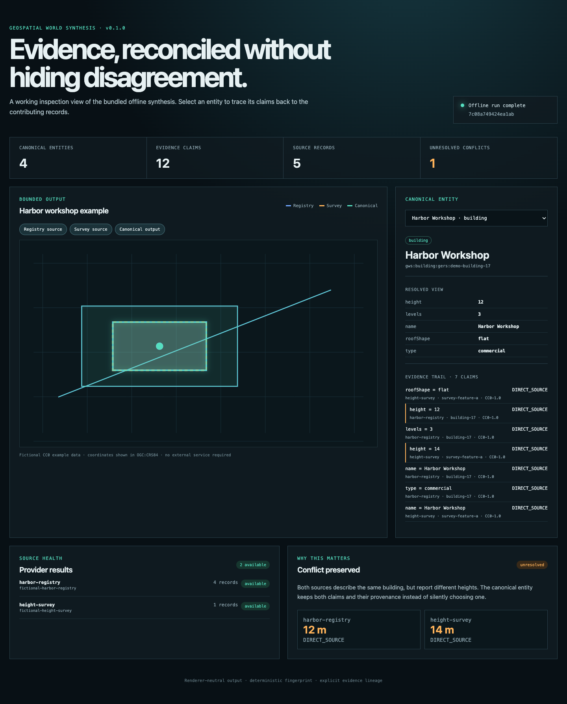

# Geospatial World Synthesis

[](https://github.com/RRG314/geospatial-world-synthesis/actions/workflows/ci.yml)
[](LICENSE)

Geospatial World Synthesis (GWS) turns bounded records from heterogeneous geospatial sources into a renderer-neutral, deterministic snapshot of canonical entities. It keeps every normalized source record and property claim, records why records were matched or kept separate, exposes disagreements and temporal status, and exports the result without requiring World Explorer or any particular database, map renderer, or application.



## Run it

Node.js 20 or newer is required. The guaranteed first run is offline, uses five fictional CC0 records, and needs no account or API key.

```bash
git clone https://github.com/RRG314/geospatial-world-synthesis.git
cd geospatial-world-synthesis
npm ci
npm run example
```

This writes `output/basic-local/world.json` and `world.geojson`. Inspect the result from the command line:

```bash
node bin/gws.js inspect output/basic-local/world.json
node bin/gws.js inspect output/basic-local/world.json --entity gws:building:gers:demo-building-17
```

Build the same snapshot into the browser evidence viewer:

```bash
npm run build
npm run viewer
```

Open <http://127.0.0.1:4173>. The [hosted GitHub Pages demo](https://rrg314.github.io/geospatial-world-synthesis/) provides the same source/canonical comparison, reconciliation evidence, claim selection, provenance, conflicts, relationships, temporal state, and neutral downloads. It is a static build of this repository and does not send user data to a backend.

## Use the API

```js
import { createLocalProvider, inspectEntity, synthesize, toGeoJson } from 'geospatial-world-synthesis';

const provider = createLocalProvider({
  id: 'my-catalog',
  datasetId: 'places-2026-09',
  sourceCrs: 'OGC:CRS84',
  licenseId: 'CC0-1.0',
  attribution: 'My example catalog',
  capabilities: ['poi'],
  records: [{
    sourceId: 'place-1',
    entityType: 'poi',
    geometry: { type: 'Point', coordinates: [-76.61, 39.29] },
    properties: { name: 'Sample place' },
    evidenceClass: 'DIRECT_SOURCE'
  }]
});

const world = await synthesize({
  bounds: [-76.62, 39.28, -76.60, 39.30],
  providers: [provider],
  reconciliation: { enabled: true }
});

console.log(inspectEntity(world, world.entities[0].id));
console.log(toGeoJson(world));
```

`synthesize()` is the primary entry point. It returns a versioned snapshot containing normalized `sourceRecords`, canonical `entities`, property `claims`, source `provenance`, provider health and coverage, attribution summaries, explicit reconciliation decisions, and a deterministic content `fingerprint`. Source IDs and canonical IDs remain separate.

## What works in 0.2.0

- Bounded provider orchestration with timeouts, capability filtering, response/record/geometry/property budgets, structured rate-limit and partial-failure status, and optional host-supplied caching.
- Built-in providers for in-memory records, local GeoJSON files, generic GeoJSON HTTP endpoints, OGC API Features, ArcGIS Feature Services, OpenStreetMap Overpass, and the small-area OpenStreetMap map API, plus a Node-only bounded Overture Buildings provider backed by Overture's maintained CLI.
- Reconciliation for buildings, POIs, addresses, parcels, and roads using stable IDs and entity-specific combinations of geometry, distance, names, addresses, and semantic types. Decisions are `MATCH`, `AMBIGUOUS`, or `NO_MATCH`; building one-to-many, many-to-one, and part/parent relationships are represented separately.
- An RBush spatial candidate index rather than all-pairs matching. A deterministic 200,000-input-record run is included in [VALIDATION.md](VALIDATION.md).
- CRS normalization for OGC:CRS84, EPSG:4326, EPSG:3857, and explicitly registered Proj4 definitions.
- GeoJSON geometry families including GeometryCollection, polygon ring/hole checks, self-intersection rejection, antimeridian diagnostics, and geodesic area measurement. Uncertain geometry is not silently repaired.
- Inspectable property-resolution reasons, original claims, evidence classes, provenance, conflicts, relationships, reconciliation scores, and temporal assessments.
- Deterministic canonical JSON, GeoJSON, FlatGeobuf, and a deliberately small PROV-JSON mapping.
- Snapshot diffing, an atomic JSON directory store, and an optional PostGIS reference store validated in CI against PostgreSQL 17 with PostGIS 3.5.
- An ESM JavaScript API, TypeScript declarations, a workflow JSON loader, and CLI commands for `synthesize`, `reconcile`, `inspect`, `diff`, and `export`.

The engine does not rank all evidence with one confidence number. Identity decisions, property evidence class, source lineage, temporal state, and application representation policy are separate and independently inspectable.

## Repeatable workflow configuration

[`examples/config-workflow/workflow.json`](examples/config-workflow/workflow.json) is a runnable, declarative local-file workflow:

```bash
node bin/gws.js synthesize examples/config-workflow/workflow.json --output output/config-workflow
node bin/gws.js export output/config-workflow/world.json --format flatgeobuf --output output/config-workflow/world.fgb
node bin/gws.js export output/config-workflow/world.json --format prov-json --output output/config-workflow/world.prov.json
```

Configuration supports `${ENVIRONMENT_VARIABLE}` expansion and resolves local-file paths relative to the configuration file. See the [provider guide](docs/providers.md) for the complete provider matrix and safety contracts.

## Examples that exercise real software

| Example | What it demonstrates | Network/data obligations |
| --- | --- | --- |
| [`basic-local`](examples/basic-local/) | Offline synthesis, conflict retention, provenance, JSON/GeoJSON | None; fictional CC0 fixture |
| [`config-workflow`](examples/config-workflow/) | Repeatable JSON configuration and local GeoJSON ingestion | None; fictional CC0 fixture |
| [`multi-source-reconciliation`](examples/multi-source-reconciliation/) | Ambiguous building candidates remain separate | None; fictional CC0 fixture |
| [`custom-provider`](examples/custom-provider/) | Provider extension using only the public contract | None; fictional CC0 fixture |
| [`temporal-evidence`](examples/temporal-evidence/) | Explicit lineage, supersession, and unresolved temporal disagreement | None; fictional CC0 fixture |
| [`incremental-update`](examples/incremental-update/) | Snapshot diff and atomic JSON persistence | None; fictional CC0 fixture |
| [`openstreetmap`](examples/openstreetmap/) | Bounded live OSM map API ingestion | ODbL; live service availability |
| [`overture-osm`](examples/overture-osm/) | Pinned Overture Buildings provider plus live OSM reconciliation | `uvx`; ODbL and source attribution |
| [`arcgis-government`](examples/arcgis-government/) | Bounded, paginated government ArcGIS Feature Service | Provider portal terms; live availability |
| [`export`](examples/export/) | Canonical JSON and GeoJSON export | None; fictional CC0 fixture |
| [`postgis`](examples/postgis/) | Optional schema initialization and transactional snapshot storage | Disposable PostGIS database required |

Live examples are deliberately not part of first-run success. Public endpoints, schemas, service terms, and rate limits can change independently of this project.

## Validation, scope, and comparison

`npm run validate:release` exercises source checks, strict declarations with a typed consumer, 37 unit/integration tests, the static viewer in Chromium, an installed tarball from a separate consumer, offline examples, exports, schemas, package boundaries, and documentation. Live-source checks and scale runs are separate so routine installation does not depend on third parties. `npm run evaluate:live` runs the optional four-country Overture/OSM source-link check documented in [VALIDATION.md](VALIDATION.md).

The bundled designed reconciliation fixture is useful for regression and baseline comparison, not a real-world accuracy estimate. The tested 100,000-record-per-source grid is a candidate-index throughput measurement, not proof of city- or planet-scale streaming. No 1-million-record result is claimed. See [VALIDATION.md](VALIDATION.md) for measurements, historical research context, and exact limitations.

[Hootenanny](https://github.com/ngageoint/hootenanny) is the closest mature open-source comparison and has substantially broader, more sophisticated conflation and review workflows. GDAL/OGR provides far broader format conversion, and PostGIS provides general durable spatial storage/querying. GWS is smaller: its useful emphasis is a portable snapshot that retains source records, per-property claims, unresolved conflicts, temporal annotations, decision explanations, and provenance together. That emphasis is demonstrated here, but novelty has not been established by an independent study.

## Documentation

- [Public API](docs/api.md)
- [Provider and workflow guide](docs/providers.md)
- [Architecture and data flow](docs/architecture.md)
- [Validation, benchmarks, and limitations](VALIDATION.md)
- [Third-party software and data obligations](THIRD_PARTY_NOTICES.md)
- [Security model](SECURITY.md)

Machine-readable [source-record](schemas/source-record.schema.json) and [synthesis-result](schemas/synthesis-result.schema.json) JSON Schemas ship with the package and are checked against executable fixtures.

## License and citation

The software is available under the [MIT License](LICENSE). Input data retains its own license, attribution, share-alike, privacy, and use restrictions; GWS metadata does not relicense it or establish that sources may legally be combined. Review [THIRD_PARTY_NOTICES.md](THIRD_PARTY_NOTICES.md) and every configured provider's current terms.

Valid CFF 1.2 citation metadata is present in [`CITATION.cff`](CITATION.cff). AI-assisted development is disclosed only in [ACKNOWLEDGEMENTS.md](ACKNOWLEDGEMENTS.md).

This is evidence-management and data-preparation infrastructure. It is not certified for surveying, cadastral title, routing, navigation, emergency response, structural decisions, or other safety-critical use.
