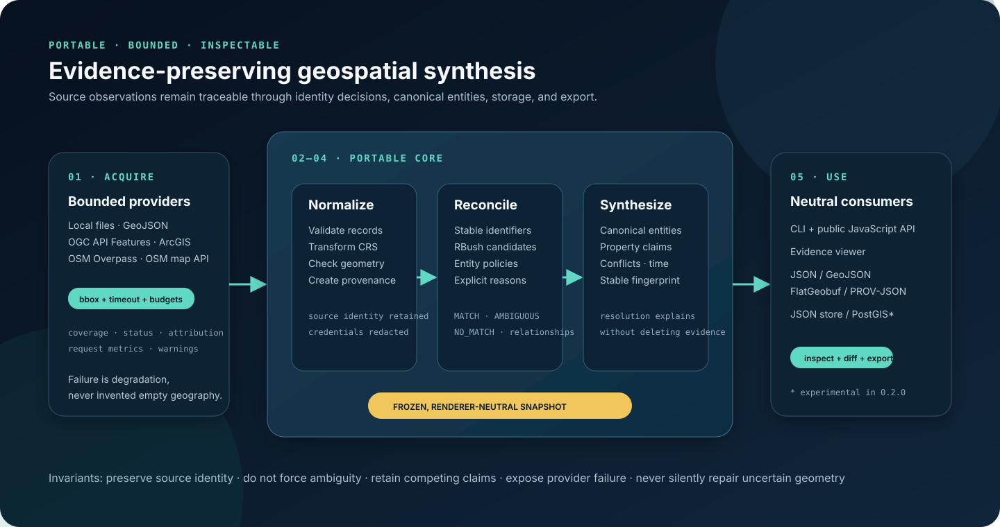

# Architecture

The portable core has no renderer, database, web framework, or World Explorer dependency. Providers acquire a bounded area; normalization creates an immutable source-evidence layer; reconciliation proposes explicit identity decisions; synthesis assembles canonical entities without deleting claims; inspection, persistence, and export consume the same frozen snapshot.

## Data flow

1. A host supplies CRS84 bounds, provider instances, capability selection, and resource limits.
2. Providers return records plus coverage, health, warnings, attribution, and request metrics. Orchestration times out/degrades failures without treating them as empty geography.
3. Normalization validates IDs and bounded JSON, transforms supported geometry to OGC:CRS84, and creates credential-redacted provenance.
4. Optional automatic reconciliation considers provider pairs in deterministic order. Stable IDs bypass spatial search; other records use an RBush bounding-box index and entity-specific evidence policies.
5. Only `MATCH` decisions join source identities. `AMBIGUOUS` and `NO_MATCH` remain separate and inspectable. Building complex relations are represented as relationships rather than forced identity.
6. Every public property becomes a claim linked to provenance. Resolution selects an effective application view while recording its reason and retaining alternatives/conflicts.
7. Synthesis emits one frozen snapshot containing source records, entities, claims, provenance, reconciliation, coverage, attributions, provider health, and a stable content fingerprint.
8. The API, CLI, static viewer, stores, and exporters read that snapshot; none needs the original provider object or World Explorer.

## Identity, evidence, and representation

These concerns are deliberately separate:

| Concern | Stored as | What it answers |
| --- | --- | --- |
| Source identity | `sourceRecords[].id`, `sourceId`, aliases | Which upstream record was observed? |
| Canonical identity | `entities[].id`, `identityScope` | Which records are currently treated as the same real-world thing? |
| Identity reasoning | `reconciliations[].decisions` | Why were two records matched, left ambiguous, or kept separate? |
| Property evidence | `claims[]`, `resolution`, `conflicts` | Who asserted each value and why was an effective value selected? |
| Temporal state | claim timestamps and temporal assessment | Is evidence current, superseded, or independently conflicting? |
| Representation | `resolveRepresentation()` result | Which candidate should a particular application display? |

There is no universal confidence scalar because these questions have different meanings and failure modes.

## Determinism

Canonical IDs, claims, provenance IDs, relationships, and snapshot fingerprints are derived through stable ordering/hashing. Fingerprints exclude retrieval timestamps, provider runtime metrics, reconciliation duration, and provider input order. They change when canonical content/evidence changes.

External data can still change between live runs. Deterministic assembly is not a promise that a mutable provider returns the same records forever.

## Candidate indexing and complexity

For each reconciliable entity type, right-side geometry envelopes are bulk-loaded into RBush. Each left record queries an envelope expanded by the entity policy's maximum candidate distance. Shared aliases/GERS IDs use a separate lookup. Expensive score functions run only on the resulting candidates.

This prevents the ordinary separated-data case from approaching `left × right` comparisons. Dense overlapping data can still produce large candidate sets, and all decisions are materialized in memory. The release has no streaming/chunked reconciliation path; see [VALIDATION.md](../VALIDATION.md) for the demonstrated boundary.

## Persistence and incremental state

`diffSnapshots()` compares stable collection members and identifies affected canonical entity IDs. The JSON directory store writes immutable fingerprinted files atomically and updates a latest pointer. The optional PostGIS reference store applies only added/removed/changed rows inside an advisory-locked transaction while retaining complete snapshots for history.

Incremental persistence currently avoids rewriting unchanged database rows; it does not yet perform partial re-acquisition or partial synthesis. The host still produces the new bounded snapshot before applying the diff.

## Geometry policy

All canonical geometry is OGC:CRS84. The engine accepts common GeoJSON geometry families and explicitly registered Proj4 coordinate systems. Validation rejects known malformed/self-intersecting geometry and reports uncertain conditions. It never silently repairs input into authoritative output.

Planar helpers are used for local candidate geometry; `geodesicAreaSquareMeters()` is available for spherical area measurement. Antimeridian crossings are warned but not cut, and complex ArcGIS ring reconstruction is intentionally out of scope.

## Interoperability boundaries

- Canonical JSON is the lossless GWS exchange format.
- GeoJSON is a convenient geometry/application view with evidence pointers, not a complete replacement for the claims/provenance arrays.
- FlatGeobuf serializes that GeoJSON view for efficient binary exchange; it does not add evidence fields beyond the GeoJSON properties.
- PROV-JSON exposes a compact lineage graph. It maps the core model but does not replace its richer claim/conflict structures or claim full PROV constraint validation.
- PostGIS is optional storage. It is not required by the core and does not turn GWS into a general spatial database.

Relevant specifications and primary references include [GeoJSON RFC 7946](https://www.rfc-editor.org/rfc/rfc7946), [OGC API Features](https://ogcapi.ogc.org/), [FlatGeobuf](https://flatgeobuf.org/), the [W3C PROV-O Recommendation](https://www.w3.org/TR/prov-o/), the non-Recommendation [PROV-JSON Member Submission](https://www.w3.org/submissions/2013/SUBM-prov-json-20130424/), and [PostGIS spatial data management](https://postgis.net/docs/using_postgis_dbmanagement.html).

## Invariants

- Source and canonical identity remain separate and inspectable.
- Ambiguity does not become identity merely to reduce entity count.
- Competing direct claims remain present after an effective value is selected.
- A failed provider contributes health metadata and no invented evidence.
- Unknown CRS and invalid geometry fail or degrade explicitly.
- Representation selection does not mutate canonical evidence.
- Output metadata records licensing obligations but never relicenses data or decides source compatibility.
